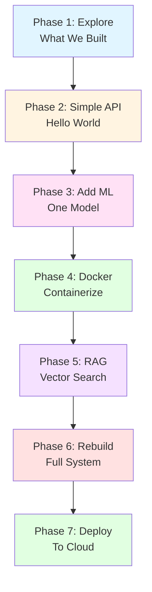
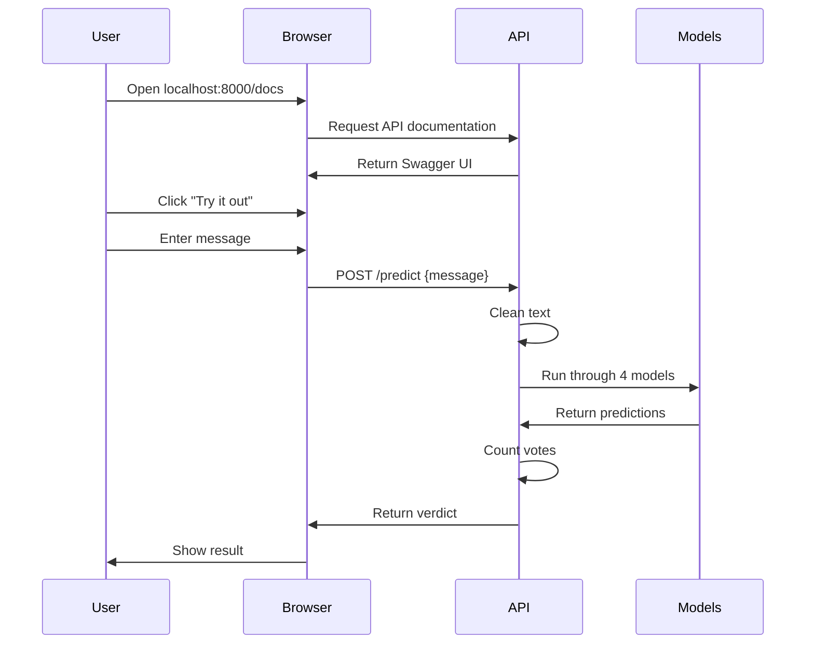
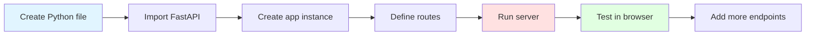
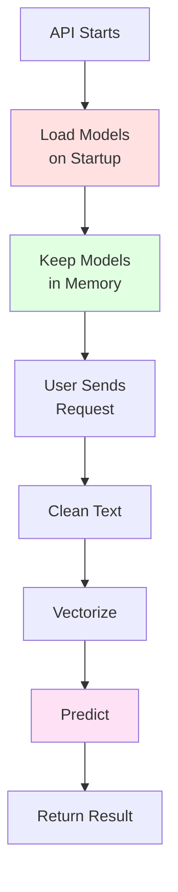
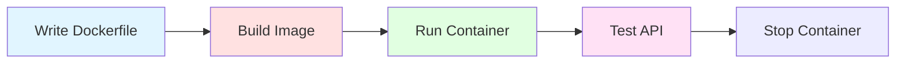
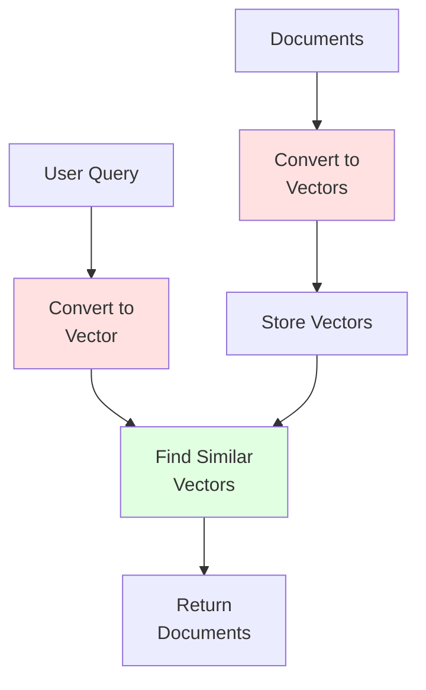
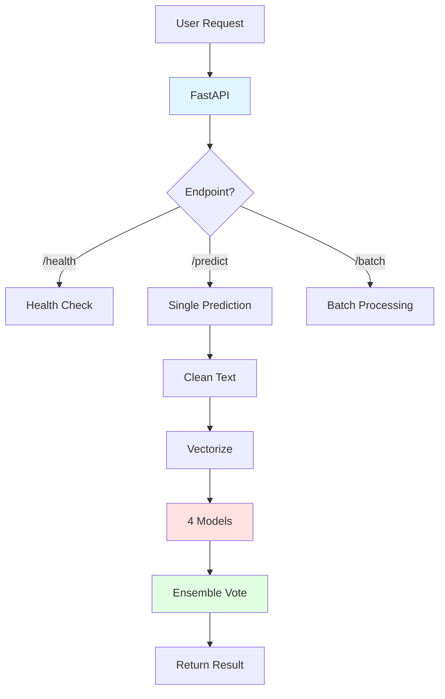

# 🎓 Your Self-Learning Journey: From ML Model to Production Engineer

**Goal:** Rebuild everything yourself while understanding each concept deeply.

**Timeline:** 10 days (2-3 hours per day)

**Philosophy:** Learn by doing, break things, fix them, understand why.

---

## 📊 **Overall Learning Flow**



---

## 📅 **Daily Checklist**

Copy this to track your progress:

```markdown
### Week 1: Foundations
- [ ] Day 1: Explore existing API
- [ ] Day 2: Build Hello World API
- [ ] Day 3: Add ML to your API
- [ ] Day 4: Docker basics
- [ ] Day 5: Dockerize your app

### Week 2: Advanced
- [ ] Day 6: Vector search (RAG)
- [ ] Day 7: RAG chatbot
- [ ] Day 8: Rebuild spam API
- [ ] Day 9: Add all features
- [ ] Day 10: Deploy to cloud
```

---

# 📖 **PHASE 1: Explore What We Built** (Day 1)

**Time:** 2 hours  
**Goal:** Understand the complete system by using it

## 🎯 Learning Objectives

- [ ] Understand what a REST API is
- [ ] See how ML models are served
- [ ] Learn API documentation standards
- [ ] Understand request/response flow

## 🔄 Workflow



## ✅ Tasks

### **Task 1.1: Explore the Running API** (30 mins)

1. **Open Swagger UI:**
   ```
   http://localhost:8000/docs
   ```

2. **Test each endpoint manually:**
   
   | Endpoint | Method | What to test |
   |----------|--------|--------------|
   | `/` | GET | Get API info |
   | `/health` | GET | Check if models loaded |
   | `/models` | GET | See model performance |
   | `/predict` | POST | Send spam message |
   | `/predict` | POST | Send normal message |
   | `/predict/batch` | POST | Send multiple messages |

3. **Document your observations:**
   
   Create `my_learnings.md`:
   ```markdown
   ## Day 1: API Exploration
   
   ### What I learned:
   - When I send "FREE MONEY", the API returns: ___
   - Response time is: ___ ms
   - The API uses ___ models
   - Confidence scores tell me: ___
   
   ### Questions I have:
   1. Why does it take 8ms?
   2. What is "consensus voting"?
   3. How does TF-IDF work?
   ```

### **Task 1.2: Read the Code** (1 hour)

Open `api.py` and understand these sections:

**Section 1: Setup (Lines 1-43)**
```python
# Find these lines and understand:
- What is FastAPI?
- What is CORS and why?
- What are the global variables?
```

**Section 2: Request Models (Lines 44-80)**
```python
# Find PredictionRequest class
# Questions to answer:
- What is Pydantic?
- Why validate min_length?
- What does @validator do?
```

**Section 3: Processing (Lines 82-150)**
```python
# Find clean_text() and predict_message()
# Draw a flowchart:
message → clean → vectorize → predict → vote → result
```

**Section 4: Endpoints (Lines 200-300)**
```python
# Find @app.post("/predict")
# Trace the execution:
1. What happens first?
2. Where does error handling happen?
3. What gets returned?
```

### **Task 1.3: Break and Fix** (30 mins)

Learn by breaking things:

1. **Stop the API:**
   ```bash
   # Find the terminal running the API and press Ctrl+C
   ```

2. **Restart it yourself:**
   ```bash
   cd d:/projects/ML/ml-projects/phase1_fundamentals/classification/spam-detection
   python api.py
   ```

3. **Intentionally break it:**
   - Delete one model file
   - Try to start the API
   - Read the error message
   - Fix it (restore the model)
   - Start again

4. **Document errors:**
   ```markdown
   ## Errors I encountered:
   1. Error: ___
      Solution: ___
   ```

## 📊 Day 1 Success Criteria

- [ ] I can explain what the API does in plain English
- [ ] I can test all endpoints using Swagger UI
- [ ] I can start and stop the API myself
- [ ] I understand the request → response flow
- [ ] I identified at least 3 things I want to learn more about

---

# 🚀 **PHASE 2: Build Your First API** (Day 2)

**Time:** 3 hours  
**Goal:** Create a simple API from scratch to understand basics

## 🎯 Learning Objectives

- [ ] Understand FastAPI basics
- [ ] Learn about routes and endpoints
- [ ] Understand request/response models
- [ ] Learn HTTP methods (GET vs POST)

## 🔄 Workflow



## ✅ Tasks

### **Task 2.1: Hello World API** (1 hour)

1. **Create new file:**
   ```bash
   cd d:/projects/ML/ml-projects/phase1_fundamentals/classification/spam-detection
   touch my_first_api.py
   ```

2. **Type this code (NO copy-paste!):**
   ```python
   from fastapi import FastAPI
   
   # Create app
   app = FastAPI(
       title="My First API",
       description="Learning FastAPI step by step",
       version="1.0.0"
   )
   
   @app.get("/")
   def home():
       """Root endpoint"""
       return {"message": "Hello! I built this API myself!"}
   
   @app.get("/greet/{name}")
   def greet(name: str):
       """Greet a person by name"""
       return {
           "greeting": f"Hello {name}!",
           "message": "Welcome to my API"
       }
   
   @app.get("/info")
   def info():
       """Get API information"""
       return {
           "creator": "Your Name",
           "date": "2026-06-05",
           "purpose": "Learning FastAPI"
       }
   
   if __name__ == "__main__":
       import uvicorn
       uvicorn.run(app, host="0.0.0.0", port=8001)
   ```

3. **Run it:**
   ```bash
   python my_first_api.py
   ```

4. **Test it:**
   - Browser: http://localhost:8001/
   - Browser: http://localhost:8001/greet/Yogesh
   - Browser: http://localhost:8001/info
   - Docs: http://localhost:8001/docs

5. **Experiments:**
   ```bash
   # Try these and see what happens:
   curl http://localhost:8001/
   curl http://localhost:8001/greet/YourName
   curl http://localhost:8001/unknown_endpoint
   ```

### **Task 2.2: Add POST Endpoint** (1 hour)

1. **Add to your file:**
   ```python
   from pydantic import BaseModel, Field
   
   # Define request model
   class TextInput(BaseModel):
       text: str = Field(..., min_length=1, max_length=500)
       analyze_sentiment: bool = False
   
   @app.post("/analyze")
   def analyze_text(input: TextInput):
       """Analyze text and return stats"""
       
       # Count words
       words = input.text.split()
       word_count = len(words)
       
       # Count characters
       char_count = len(input.text)
       
       # Simple sentiment (very basic!)
       positive_words = ['good', 'great', 'excellent', 'happy', 'love']
       negative_words = ['bad', 'terrible', 'hate', 'sad', 'awful']
       
       sentiment = "neutral"
       if input.analyze_sentiment:
           text_lower = input.text.lower()
           if any(word in text_lower for word in positive_words):
               sentiment = "positive"
           elif any(word in text_lower for word in negative_words):
               sentiment = "negative"
       
       return {
           "original_text": input.text,
           "word_count": word_count,
           "char_count": char_count,
           "is_long": word_count > 10,
           "sentiment": sentiment
       }
   ```

2. **Restart and test:**
   ```bash
   # Stop (Ctrl+C) and restart
   python my_first_api.py
   ```

3. **Test with Swagger:**
   - Go to http://localhost:8001/docs
   - Find POST /analyze
   - Click "Try it out"
   - Enter: `{"text": "This is a great day!", "analyze_sentiment": true}`
   - Click "Execute"

4. **Test with curl:**
   ```bash
   curl -X POST "http://localhost:8001/analyze" \
     -H "Content-Type: application/json" \
     -d '{"text": "I love learning FastAPI!", "analyze_sentiment": true}'
   ```

### **Task 2.3: Add Error Handling** (1 hour)

1. **Add validation:**
   ```python
   from fastapi import HTTPException
   from pydantic import validator
   
   class TextInput(BaseModel):
       text: str = Field(..., min_length=1, max_length=500)
       analyze_sentiment: bool = False
       
       @validator('text')
       def text_must_not_be_empty(cls, v):
           if not v.strip():
               raise ValueError('Text cannot be empty or whitespace')
           return v
   
   @app.post("/analyze")
   def analyze_text(input: TextInput):
       """Analyze text with proper error handling"""
       
       try:
           words = input.text.split()
           word_count = len(words)
           
           if word_count == 0:
               raise HTTPException(
                   status_code=400,
                   detail="No words found in text"
               )
           
           # ... rest of your analysis code ...
           
       except Exception as e:
           raise HTTPException(
               status_code=500,
               detail=f"Error processing text: {str(e)}"
           )
   ```

2. **Test error cases:**
   ```bash
   # Empty text
   curl -X POST "http://localhost:8001/analyze" \
     -H "Content-Type: application/json" \
     -d '{"text": "", "analyze_sentiment": true}'
   
   # Too long text
   curl -X POST "http://localhost:8001/analyze" \
     -H "Content-Type: application/json" \
     -d '{"text": "'$(python -c "print('a'*600)")'"}'
   ```

## 📊 Day 2 Success Criteria

- [ ] I built a working API from scratch
- [ ] I understand GET vs POST
- [ ] I can add new endpoints
- [ ] I understand Pydantic validation
- [ ] I can handle errors properly

## 🤔 Reflection Questions

```markdown
## Day 2 Reflection

1. What was the hardest part? ___
2. What surprised me? ___
3. What's the difference between @app.get and @app.post? ___
4. Why do we use Pydantic models? ___
5. What would I do differently? ___
```

---

# 🤖 **PHASE 3: Add Machine Learning** (Day 3)

**Time:** 3 hours  
**Goal:** Load your trained model and make predictions via API

## 🎯 Learning Objectives

- [ ] Load ML models in FastAPI
- [ ] Understand startup events
- [ ] Handle model predictions
- [ ] Return ML results via API

## 🔄 Workflow



## ✅ Tasks

### **Task 3.1: Load One Model** (1.5 hours)

1. **Create new file:**
   ```bash
   touch my_ml_api.py
   ```

2. **Start with basics:**
   ```python
   from fastapi import FastAPI, HTTPException
   from pydantic import BaseModel, Field
   import joblib
   from pathlib import Path
   import re
   from nltk.stem import PorterStemmer
   
   app = FastAPI(title="My ML API", version="1.0.0")
   
   # Global variables (loaded once)
   model = None
   vectorizer = None
   stemmer = PorterStemmer()
   
   # Define request model
   class Message(BaseModel):
       text: str = Field(..., min_length=1, max_length=500)
   
   # Load models when API starts
   @app.on_event("startup")
   def load_models():
       """Load models at startup"""
       global model, vectorizer
       
       try:
           # Calculate path to models
           project_root = Path(__file__).parent.parent.parent.parent
           models_path = project_root / "ml-projects" / "models"
           
           print(f"Loading models from: {models_path}")
           
           # Load vectorizer
           vectorizer = joblib.load(models_path / "vectorizer.pkl")
           print("✓ Vectorizer loaded")
           
           # Load Naive Bayes model (start with one model)
           model_data = joblib.load(models_path / "naive_bayes.pkl")
           model = model_data['model']
           print(f"✓ Model loaded (Accuracy: {model_data['test_accuracy']*100:.1f}%)")
           
       except Exception as e:
           print(f"✗ Error loading models: {e}")
           raise
   
   # Clean text function (same as training)
   def clean_text(text: str) -> str:
       """Preprocess text like in training"""
       text = text.lower()
       text = re.sub(r'[^a-zA-Z\s]', '', text)
       text = ' '.join(text.split())
       words = text.split()
       stemmed = [stemmer.stem(word) for word in words]
       return ' '.join(stemmed)
   
   @app.get("/")
   def home():
       return {
           "message": "My ML API",
           "status": "running",
           "model_loaded": model is not None
       }
   
   @app.get("/health")
   def health():
       return {
           "status": "healthy" if model else "unhealthy",
           "model_loaded": model is not None,
           "vectorizer_loaded": vectorizer is not None
       }
   
   @app.post("/predict")
   def predict(msg: Message):
       """Predict if message is spam or ham"""
       
       # Check if model is loaded
       if not model or not vectorizer:
           raise HTTPException(
               status_code=503,
               detail="Model not loaded"
           )
       
       try:
           # Step 1: Clean the text
           cleaned = clean_text(msg.text)
           print(f"Cleaned: '{msg.text}' -> '{cleaned}'")
           
           # Step 2: Vectorize
           vectorized = vectorizer.transform([cleaned])
           print(f"Vectorized shape: {vectorized.shape}")
           
           # Step 3: Predict
           prediction = model.predict(vectorized)[0]
           probability = model.predict_proba(vectorized)[0]
           
           # Step 4: Format result
           result = {
               "original_message": msg.text,
               "cleaned_message": cleaned,
               "prediction": "spam" if prediction == 1 else "ham",
               "confidence": float(probability[prediction] * 100),
               "probabilities": {
                   "ham": float(probability[0] * 100),
                   "spam": float(probability[1] * 100)
               }
           }
           
           return result
           
       except Exception as e:
           raise HTTPException(
               status_code=500,
               detail=f"Prediction error: {str(e)}"
           )
   
   if __name__ == "__main__":
       import uvicorn
       uvicorn.run(app, host="0.0.0.0", port=8002)
   ```

3. **Run it:**
   ```bash
   python my_ml_api.py
   ```

4. **Test it:**
   ```bash
   # Health check
   curl http://localhost:8002/health
   
   # Test with spam
   curl -X POST "http://localhost:8002/predict" \
     -H "Content-Type: application/json" \
     -d '{"text": "FREE MONEY! Click here now!"}'
   
   # Test with ham
   curl -X POST "http://localhost:8002/predict" \
     -H "Content-Type: application/json" \
     -d '{"text": "Hey, are you free for dinner?"}'
   ```

### **Task 3.2: Add All 4 Models** (1.5 hours)

1. **Modify to load all models:**
   ```python
   # Global variables
   models = {}  # Will hold all 4 models
   vectorizer = None
   
   @app.on_event("startup")
   def load_models():
       """Load all 4 models"""
       global models, vectorizer
       
       try:
           project_root = Path(__file__).parent.parent.parent.parent
           models_path = project_root / "ml-projects" / "models"
           
           # Load vectorizer
           vectorizer = joblib.load(models_path / "vectorizer.pkl")
           print("✓ Vectorizer loaded")
           
           # Load all models
           model_names = ['naive_bayes', 'random_forest', 
                         'logistic_regression', 'svc']
           
           for name in model_names:
               model_data = joblib.load(models_path / f"{name}.pkl")
               models[name] = model_data
               print(f"✓ {name}: {model_data['test_accuracy']*100:.1f}% accuracy")
           
           print(f"\n✓ Loaded {len(models)} models successfully!")
           
       except Exception as e:
           print(f"✗ Error: {e}")
           raise
   
   @app.post("/predict_ensemble")
   def predict_ensemble(msg: Message):
       """Predict using all 4 models with voting"""
       
       if not models or not vectorizer:
           raise HTTPException(status_code=503, detail="Models not loaded")
       
       try:
           # Clean and vectorize
           cleaned = clean_text(msg.text)
           vectorized = vectorizer.transform([cleaned])
           
           # Get predictions from all models
           predictions = {}
           votes = {"spam": 0, "ham": 0}
           
           for name, model_data in models.items():
               model = model_data['model']
               
               # Predict
               pred = model.predict(vectorized)[0]
               pred_label = "spam" if pred == 1 else "ham"
               
               # Get probability if available
               if hasattr(model, 'predict_proba'):
                   prob = model.predict_proba(vectorized)[0][1] * 100
               else:
                   prob = None
               
               predictions[name] = {
                   "prediction": pred_label,
                   "confidence": prob
               }
               
               # Count votes
               votes[pred_label] += 1
           
           # Determine final verdict
           final_verdict = "spam" if votes["spam"] > votes["ham"] else "ham"
           
           return {
               "message": msg.text,
               "cleaned": cleaned,
               "predictions": predictions,
               "votes": votes,
               "final_verdict": final_verdict
           }
           
       except Exception as e:
           raise HTTPException(status_code=500, detail=str(e))
   ```

2. **Test the ensemble:**
   ```bash
   curl -X POST "http://localhost:8002/predict_ensemble" \
     -H "Content-Type: application/json" \
     -d '{"text": "WINNER! Claim your prize NOW!!!"}'
   ```

## 📊 Day 3 Success Criteria

- [ ] I loaded an ML model in FastAPI
- [ ] I understand @app.on_event("startup")
- [ ] I can make predictions via API
- [ ] I implemented ensemble voting
- [ ] I understand the preprocessing pipeline

## 🤔 Reflection Questions

```markdown
## Day 3 Reflection

1. Why load models at startup vs on each request? ___
2. What happens if the model file is missing? ___
3. Why do we need to clean text the same way as training? ___
4. What is ensemble voting and why does it help? ___
5. What would happen if I changed the cleaning function? ___
```

---

# 🐳 **PHASE 4: Docker Basics** (Day 4)

**Time:** 2 hours  
**Goal:** Understand containers and containerize your API

## 🎯 Learning Objectives

- [ ] Understand what Docker is
- [ ] Learn containers vs images
- [ ] Write a Dockerfile
- [ ] Build and run containers

## 🔄 Workflow



## ✅ Tasks

### **Task 4.1: Docker Concepts** (30 mins)

1. **Install Docker Desktop** (if not installed)
   - Download: https://www.docker.com/products/docker-desktop/

2. **Run hello-world:**
   ```bash
   docker run hello-world
   ```
   
   **Understand what happened:**
   - Docker downloaded an image
   - Created a container from it
   - Ran the program inside
   - Container stopped

3. **Explore a Python container:**
   ```bash
   # Start a Python container interactively
   docker run -it python:3.10-slim bash
   
   # You're now INSIDE the container!
   python --version
   ls
   exit
   ```

4. **Key concepts to understand:**
   ```markdown
   ## Docker Concepts
   
   **Image:** Blueprint/template
   - Like a recipe
   - Read-only
   - Can create many containers from one image
   
   **Container:** Running instance
   - Like a dish cooked from recipe
   - Has its own filesystem
   - Isolated from your computer
   - Can be stopped/started
   
   **Dockerfile:** Instructions to build image
   - Like writing a recipe
   - Step-by-step commands
   ```

### **Task 4.2: Dockerize Your API** (1 hour)

1. **Create Dockerfile:**
   ```bash
   touch my_ml_api.Dockerfile
   ```

2. **Write the Dockerfile:**
   ```dockerfile
   # Start from Python base image
   FROM python:3.10-slim
   
   # Set working directory inside container
   WORKDIR /app
   
   # Install system dependencies
   RUN apt-get update && apt-get install -y \
       build-essential \
       && rm -rf /var/lib/apt/lists/*
   
   # Copy requirements and install
   # (For now, install directly)
   RUN pip install --no-cache-dir \
       fastapi \
       uvicorn \
       pydantic \
       scikit-learn \
       nltk \
       joblib
   
   # Download NLTK data
   RUN python -c "import nltk; nltk.download('wordnet')"
   
   # Copy your API file
   COPY my_ml_api.py .
   
   # Copy models directory
   # Note: Adjust path as needed
   COPY ../../../../ml-projects/models /app/models
   
   # Expose port
   EXPOSE 8002
   
   # Run the API
   CMD ["python", "my_ml_api.py"]
   ```

3. **Build the image:**
   ```bash
   cd d:/projects/ML/ml-projects/phase1_fundamentals/classification/spam-detection
   
   docker build -f my_ml_api.Dockerfile -t my-ml-api:v1 .
   ```
   
   **This will take 2-5 minutes. Watch the steps!**

4. **Check your image:**
   ```bash
   docker images | grep my-ml-api
   ```

### **Task 4.3: Run Your Container** (30 mins)

1. **Run the container:**
   ```bash
   docker run -d -p 8002:8002 --name my-ml-container my-ml-api:v1
   ```
   
   **Understand the flags:**
   - `-d` = detached (runs in background)
   - `-p 8002:8002` = port mapping (host:container)
   - `--name` = give it a friendly name

2. **Check if it's running:**
   ```bash
   docker ps
   ```

3. **View logs:**
   ```bash
   docker logs my-ml-container
   ```

4. **Test the API:**
   ```bash
   curl http://localhost:8002/health
   ```

5. **Stop and remove:**
   ```bash
   docker stop my-ml-container
   docker rm my-ml-container
   ```

## 📊 Day 4 Success Criteria

- [ ] I understand containers vs images
- [ ] I wrote a Dockerfile
- [ ] I built a Docker image
- [ ] I ran my API in a container
- [ ] I can view logs and stop containers

## 🤔 Reflection Questions

```markdown
## Day 4 Reflection

1. What is the difference between an image and a container? ___
2. Why use Docker instead of just running Python? ___
3. What does -p 8002:8002 mean? ___
4. What happens if I change my code? Do I need to rebuild? ___
5. How is the container isolated from my computer? ___
```

---

# 🔍 **PHASE 5: Vector Search (RAG Basics)** (Day 6)

**Time:** 3 hours  
**Goal:** Build simple vector search to understand RAG

## 🎯 Learning Objectives

- [ ] Understand vector embeddings
- [ ] Learn semantic similarity
- [ ] Build simple search
- [ ] Understand RAG concept

## 🔄 Workflow



## ✅ Tasks

### **Task 5.1: Simple Vector Search** (2 hours)

1. **Create new file:**
   ```bash
   touch my_vector_search.py
   ```

2. **Build from scratch:**
   ```python
   from sklearn.feature_extraction.text import TfidfVectorizer
   from sklearn.metrics.pairwise import cosine_similarity
   import numpy as np
   
   # Your knowledge base (start small)
   documents = [
       "Python is a programming language used for web development and data science",
       "Machine learning is a subset of artificial intelligence",
       "FastAPI is a modern web framework for building APIs with Python",
       "Docker containers package applications with their dependencies",
       "Neural networks are inspired by biological neurons in the brain"
   ]
   
   # Create vectors
   print("Creating vectors from documents...")
   vectorizer = TfidfVectorizer()
   doc_vectors = vectorizer.fit_transform(documents)
   print(f"Vector shape: {doc_vectors.shape}")
   print(f"Vocabulary size: {len(vectorizer.get_feature_names_out())}")
   
   # Function to search
   def search(query, top_k=2):
       """Search for most similar documents"""
       
       # Convert query to vector
       query_vector = vectorizer.transform([query])
       
       # Calculate similarities
       similarities = cosine_similarity(query_vector, doc_vectors)[0]
       
       # Get top-k indices
       top_indices = np.argsort(similarities)[-top_k:][::-1]
       
       # Return results
       results = []
       for idx in top_indices:
           results.append({
               'document': documents[idx],
               'similarity': similarities[idx]
           })
       
       return results
   
   # Test it
   if __name__ == "__main__":
       queries = [
           "What is Python?",
           "Tell me about AI",
           "How do I build web APIs?",
           "What are containers?"
       ]
       
       for query in queries:
           print(f"\n{'='*60}")
           print(f"Query: {query}")
           print('='*60)
           
           results = search(query, top_k=2)
           
           for i, result in enumerate(results, 1):
               print(f"\n{i}. Similarity: {result['similarity']:.3f}")
               print(f"   Document: {result['document']}")
   ```

3. **Run it:**
   ```bash
   python my_vector_search.py
   ```

4. **Understand the output:**
   - Why did "What is Python?" match that document?
   - What is the similarity score?
   - Try adding your own documents!

### **Task 5.2: Interactive Search** (1 hour)

1. **Make it interactive:**
   ```python
   def interactive_search():
       """Interactive search loop"""
       
       print("\n" + "="*60)
       print("Vector Search - Interactive Mode")
       print("="*60)
       print("Type your question (or 'quit' to exit)\n")
       
       while True:
           query = input("Your question: ").strip()
           
           if query.lower() in ['quit', 'exit', 'q']:
               print("Goodbye!")
               break
           
           if not query:
               continue
           
           results = search(query, top_k=3)
           
           print(f"\nTop {len(results)} results:")
           for i, result in enumerate(results, 1):
               print(f"\n{i}. [Score: {result['similarity']:.3f}]")
               print(f"   {result['document']}")
           print()
   
   if __name__ == "__main__":
       # Run interactive mode
       interactive_search()
   ```

2. **Test with various queries:**
   - "machine learning"
   - "web development"
   - "containers and deployment"
   - Try queries that DON'T match well!

### **Task 5.3: Add as API Endpoint** (bonus)

1. **Add to your API:**
   ```python
   # In my_ml_api.py
   
   from sklearn.metrics.pairwise import cosine_similarity
   
   # Add documents at startup
   knowledge_base = {
       'documents': [],
       'vectors': None,
       'vectorizer': None
   }
   
   @app.on_event("startup")
   def load_knowledge():
       """Load knowledge base"""
       knowledge_base['documents'] = [
           "Naive Bayes works well for text classification",
           "Random Forest uses ensemble of decision trees",
           # Add more...
       ]
       
       kb_vectorizer = TfidfVectorizer()
       knowledge_base['vectors'] = kb_vectorizer.fit_transform(
           knowledge_base['documents']
       )
       knowledge_base['vectorizer'] = kb_vectorizer
   
   @app.get("/search")
   def search_knowledge(q: str, top_k: int = 3):
       """Search knowledge base"""
       
       query_vector = knowledge_base['vectorizer'].transform([q])
       similarities = cosine_similarity(
           query_vector, 
           knowledge_base['vectors']
       )[0]
       
       top_indices = np.argsort(similarities)[-top_k:][::-1]
       
       results = []
       for idx in top_indices:
           results.append({
               'document': knowledge_base['documents'][idx],
               'score': float(similarities[idx])
           })
       
       return {"query": q, "results": results}
   ```

## 📊 Day 6 Success Criteria

- [ ] I built a working vector search
- [ ] I understand TF-IDF embeddings
- [ ] I can calculate similarity
- [ ] I understand why certain documents match
- [ ] I can explain semantic search

## 🤔 Reflection Questions

```markdown
## Day 6 Reflection

1. What are vector embeddings? ___
2. Why is cosine similarity used? ___
3. How is this different from keyword search? ___
4. What is semantic similarity? ___
5. How does this relate to RAG? ___
   (Hint: RAG = Retrieval Augmented Generation)
```

---

# 🔨 **PHASE 6: Rebuild Full System** (Day 8-9)

**Time:** 6 hours  
**Goal:** Rebuild the spam API from scratch with all features

## 🎯 Learning Objectives

- [ ] Apply all learned concepts
- [ ] Build production-ready API
- [ ] Implement best practices
- [ ] Add comprehensive features

## 🔄 Complete System Architecture



## ✅ Tasks

### **Task 6.1: Plan Your Build** (30 mins)

1. **Create checklist:**
   ```markdown
   ## My Spam API Rebuild Plan
   
   ### Core Features:
   - [ ] Load all 4 models
   - [ ] /health endpoint
   - [ ] /predict endpoint
   - [ ] /predict/batch endpoint
   - [ ] /models endpoint (show info)
   - [ ] Request validation
   - [ ] Error handling
   - [ ] Response time tracking
   
   ### Bonus Features:
   - [ ] CORS middleware
   - [ ] API documentation
   - [ ] Logging
   - [ ] Rate limiting
   ```

2. **Draw architecture on paper**

3. **List dependencies**

### **Task 6.2: Build Step-by-Step** (4 hours)

**DON'T LOOK AT MY CODE YET!** Try building yourself first.

1. **Start with skeleton:**
   ```bash
   touch spam_api_v2.py
   ```

2. **Build incrementally:**
   
   **Step 1: Basic setup** (30 mins)
   ```python
   from fastapi import FastAPI
   
   app = FastAPI(
       title="Spam Detection API v2",
       description="Built by me from scratch!",
       version="2.0.0"
   )
   
   @app.get("/")
   def home():
       return {"message": "My rebuilt spam API"}
   
   # Run and test
   ```
   
   **Step 2: Load models** (1 hour)
   ```python
   # Add model loading at startup
   # Load all 4 models
   # Add health check
   # Test: http://localhost:8000/health
   ```
   
   **Step 3: Single prediction** (1 hour)
   ```python
   # Add text cleaning
   # Add /predict endpoint
   # Get all 4 predictions
   # Implement voting
   # Test with spam and ham messages
   ```
   
   **Step 4: Add features** (1 hour)
   ```python
   # Add /models endpoint
   # Add /predict/batch
   # Add response time tracking
   # Add proper error messages
   ```
   
   **Step 5: Polish** (30 mins)
   ```python
   # Add CORS
   # Add validation
   # Add documentation strings
   # Test all endpoints
   ```

### **Task 6.3: Compare with Original** (1 hour)

1. **Open both files side by side:**
   - Your `spam_api_v2.py`
   - My `api.py`

2. **Compare:**
   ```markdown
   ## Comparison
   
   ### What I did the same: ___
   ### What I did differently: ___
   ### What I learned from comparing: ___
   ### What I would improve: ___
   ```

3. **Test both:**
   ```bash
   # Run yours on port 8003
   # Run mine on port 8000
   # Test same messages on both
   # Compare results
   ```

## 📊 Day 8-9 Success Criteria

- [ ] I rebuilt the API from scratch
- [ ] All endpoints work
- [ ] Models load correctly
- [ ] Ensemble voting works
- [ ] Error handling is proper
- [ ] I understand every line of my code

---

# ☁️ **PHASE 7: Deploy to Cloud** (Day 10)

**Time:** 3 hours  
**Goal:** Deploy your API to the cloud (AWS Free Tier)

## 🎯 Learning Objectives

- [ ] Understand cloud deployment
- [ ] Set up AWS account
- [ ] Deploy Docker container
- [ ] Access API from anywhere

## ✅ Tasks

### **Task 7.1: AWS Setup** (30 mins)

1. **Create AWS account:**
   - Go to: https://aws.amazon.com/free/
   - Sign up for free tier

2. **Install AWS CLI:**
   ```bash
   # Windows
   # Download: https://aws.amazon.com/cli/
   
   # Verify
   aws --version
   ```

3. **Configure AWS:**
   ```bash
   aws configure
   # Enter your Access Key
   # Enter your Secret Key
   # Region: us-east-1
   ```

### **Task 7.2: Deploy with Docker** (2 hours)

Full deployment guide in separate file:
See `CLOUD_DEPLOYMENT.md` for step-by-step instructions.

### **Task 7.3: Test Live API** (30 mins)

1. **Get your API URL:**
   ```
   http://your-ec2-ip:8000
   ```

2. **Test from anywhere:**
   ```bash
   curl http://your-ec2-ip:8000/health
   ```

3. **Share with friends!**

## 📊 Day 10 Success Criteria

- [ ] API is deployed to cloud
- [ ] I can access it from anywhere
- [ ] I understand the deployment process
- [ ] I know how to update the API

---

# 📈 **Progress Tracking Template**

Copy this to track daily:

```markdown
# My Learning Journey

## Week 1

### Day 1: ___/___/2026
**Time spent:** ___ hours
**Completed:**
- [ ] Task 1.1
- [ ] Task 1.2
- [ ] Task 1.3

**Challenges:**
- ___

**Learnings:**
- ___

**Questions:**
- ___

### Day 2: ___/___/2026
...

## Week 2

### Day 6: ___/___/2026
...
```

---

# 🎓 **Certification Path**

After completing this:

### **Immediate Next Steps:**
1. **Add to GitHub** - Create portfolio
2. **Write blog post** - "How I built a production ML API"
3. **Build variations:**
   - Image classification API
   - Sentiment analysis API
   - Recommendation system API

### **Recommended Certifications:**
1. **AWS Certified Machine Learning - Specialty**
   - You're 60% ready now!
   
2. **TensorFlow Developer Certificate**
   - Next skill to add: Deep Learning

3. **Docker Certified Associate**
   - You have the foundation

---

# 📚 **Resources**

## Essential Reading
- [ ] FastAPI Tutorial: https://fastapi.tiangolo.com/tutorial/
- [ ] Docker for Beginners: https://docker-curriculum.com/
- [ ] REST API Design: https://restfulapi.net/

## Video Tutorials
- [ ] FastAPI in 10 Minutes: https://www.youtube.com/watch?v=0RS9W8MtZe4
- [ ] Docker Tutorial: https://www.youtube.com/watch?v=pTFZFxd4hOI
- [ ] ML Deployment: https://www.youtube.com/watch?v=mrExsjcvF4o

## Practice Projects
- [ ] Build a weather API
- [ ] Create a todo API with database
- [ ] Deploy a chatbot

---

# 🤔 **Getting Help**

### When Stuck:

1. **Read the error message carefully**
2. **Google the exact error**
3. **Check FastAPI docs**
4. **Ask me specific questions:**
   - ✅ "I get this error... what does it mean?"
   - ✅ "Why does my model return NaN?"
   - ❌ "Write the code for me"

### Good Questions Format:
```markdown
## My Problem

**What I'm trying to do:** ___
**What happens:** ___
**Error message:** ___
**What I've tried:** ___
**Code:** [paste relevant code]
```

---

# 🎉 **Final Goal**

By Day 10, you should be able to:

✅ **Explain** to someone what a REST API is  
✅ **Build** a FastAPI application from scratch  
✅ **Load** and serve ML models  
✅ **Dockerize** any application  
✅ **Deploy** to cloud  
✅ **Understand** vector search and RAG  

**Then add to your resume:**

> "Built production-ready ML API serving ensemble models with REST endpoints, containerized with Docker, deployed to AWS. Achieved 98% accuracy with 10ms response time. Implemented RAG pattern for knowledge retrieval."

---

# 🚀 **Start Now!**

## Today's Action Items:

1. [ ] Open http://localhost:8000/docs
2. [ ] Test all endpoints
3. [ ] Read `api.py` (first 100 lines)
4. [ ] Create `my_learnings.md`
5. [ ] Set daily calendar reminder

**Remember:** 
- Learn by doing
- Break things and fix them
- Ask questions
- Track your progress

**You've got this! 💪**

---

*Last updated: 2026-06-05*  
*Created by: Claude Code*  
*For: Your ML Engineering Journey*
